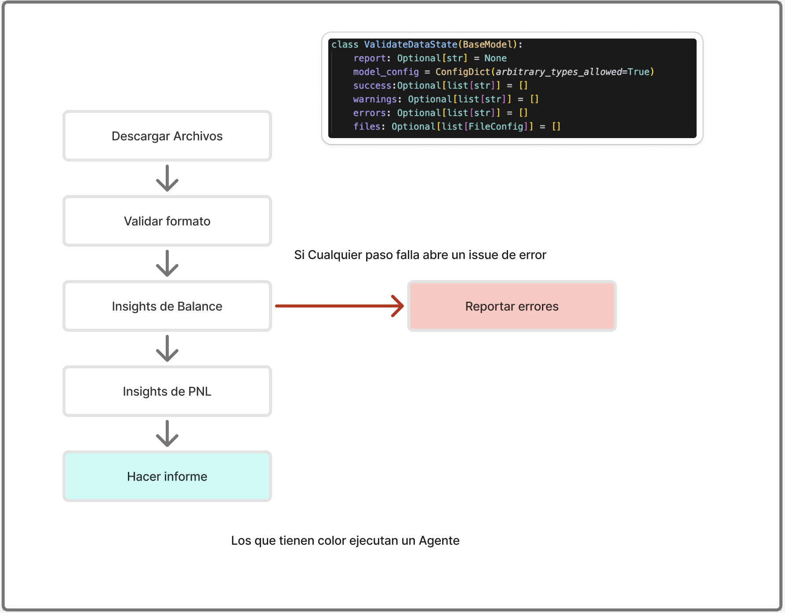
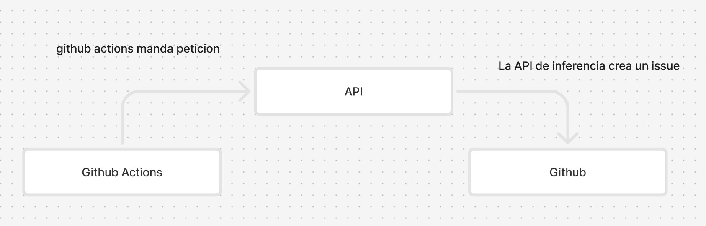

# Autonomous Financial Auditor

> [!NOTE]  
> Si quieres probar esto en produccion la app esta deployanda en un server gratis primero entrar a esta pagina y esperar que cargue <https://lazo-interview.onrender.com>.

## Instrucciones

1. Se necesitan las siguientes variables:

```
ANTHROPIC_CHAT_MODEL="claude-3-7-sonnet-20250219"
ANTHROPIC_API_KEY=
IS_PRODUCTION=False
GITHUB_TOKEN=
```

2. Una vez que tengas esto, puedes ejecutar el siguiente comando:

```
docker-compose up --build
```

3. Una vez que el contenedor esté activo, puedes hacer una llamada GET a la API de inferencia:

```
curl -X GET https://lazo-interview.onrender.com/audit
```

4. Esto creará un issue en GitHub:

<https://github.com/arturxdev/lazo-interview/issues>

Nuestro SaaS con enfoque AI-First ayuda a los equipos financieros a detectar errores en reportes antes de que lleguen a instancias superiores. En muchos casos, los archivos de **Pérdidas y Ganancias (P&L)** y el **Balance General**, almacenados en un repositorio de GitHub (en formato Markdown o CSV), tienden a desincronizarse o contener inconsistencias contables.

## Lógica

Dentro de la librería existían dos maneras de abordar este problema:

- Workflow
- AgenticWorkflow

Yo decidí ir por el camino del `Workflow`, ya que solo se necesitaban generar resúmenes de alertas para el cliente, y lo dividí en los siguientes pasos:



Para esto, tengo una memoria compartida para todo el workflow donde recolecto los `warnings`, `success` y `errores` para alimentar al modelo con esta información y que pueda generar un informe.

# Infraestructura

La forma de desplegar el producto que elegí fue la siguiente:



## Mejoras

- **Base de datos vectorial**: podría guardar los resultados, errores y advertencias, y con esto analizar eventos pasados. Actualmente, proceso los archivos crudos directamente desde CSV.
- **Mejorar la información entregada al usuario**: hoy realizo solo una comparación de números por cuatrimestre, pero entendiendo mejor la lógica del negocio, esto podría ampliarse considerablemente.
